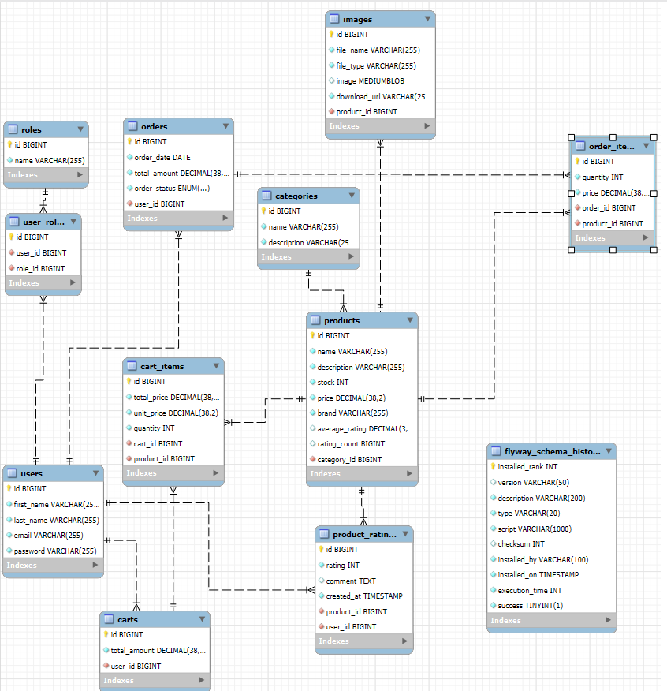

# E-commerce Application

This project is a simple e-commerce application that allows users to browse products, place orders, and manage accounts. The application supports user roles, including customers and admins, with different home pages and functionalities for each role.

## Project Tech Stack

- **Java 17**
- **Spring Boot 3.x**
    - Spring MVC
    - Spring Data JPA
    - Spring Security 6.x
- **MySQL**: Database for storing user, product, order, and category data.
- **Thymeleaf**: Template engine for rendering HTML views.
- **Bootstrap 5**: For responsive UI design.
- **Maven**: Build and dependency management tool.

## Requirements

- **JDK 17**: Ensure Java 17 is installed and configured on your machine.
- **MySQL**: Set up a MySQL server and create a database named `order_app`.
- **Maven**: Install Maven for building and running the project.

## ER Diagram
Below is the Entity-Relationship (ER) diagram for the application:



The diagram outlines the database schema, including tables for users, customers, admins, orders, products, categories, and their relationships.

## Key Features

- **User Authentication**: Login functionality for both customers and admins.
- **Role-Based Access Control**: Separate home pages and functionalities based on user roles.
- **Product Browsing**: Customers can browse available products and place orders.
- **Order Management**: Customers can view their orders, and admins can manage all orders.


## Setup Instructions

### 1. Clone the Repository

Clone the repository to your local machine using the following command:

```bash
git clone https://github.com/yourusername/ecommerce-app.git
cd ecommerce-app
```

### 2. Configure the Application
Update the src/main/resources/application.properties file with your MySQL database credentials:

```properties
spring.datasource.url=jdbc:mysql://localhost:3306/order_app
spring.datasource.username=your_mysql_username
spring.datasource.password=your_mysql_password
```

### 3. Build the Project
Build the project using Maven:
```bash
mvn clean install
```

### 4. Run the Application
Run the application using the following command:
```bash
mvn spring-boot:run
```
### 5. Access the Application
Open your browser and go to http://localhost:8080 to access the application.


